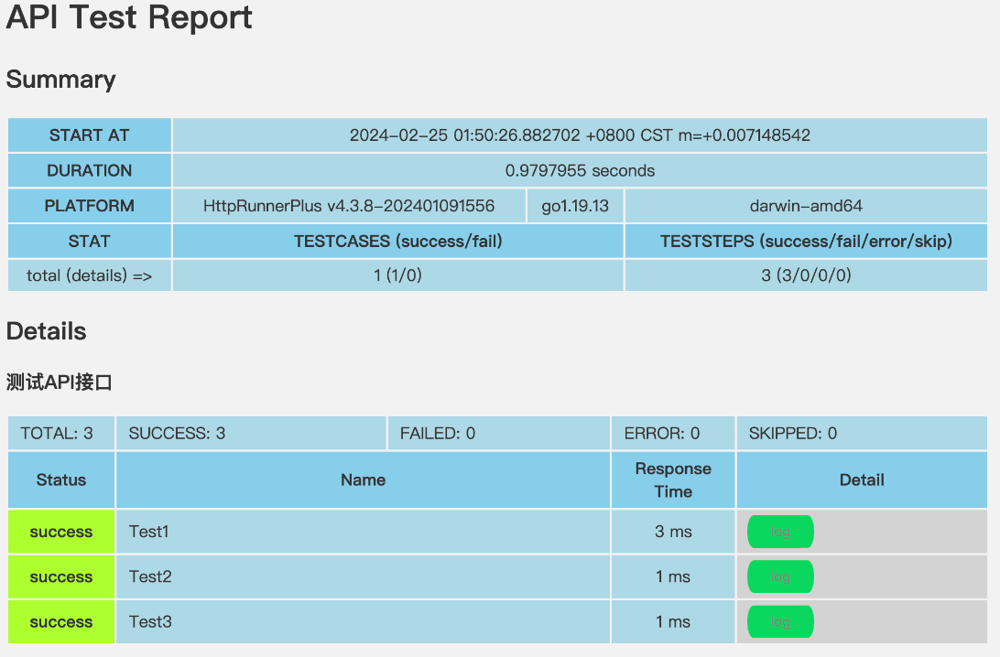

# Tencent-Test

本项目是腾讯云西安子公司，性能工程团队面试初筛项目。项目实现与报告已经上传至Github：https://github.com/jackwang0108/tencent-test.git

项目最终的接口实现代码、接口测试报告、压力测试报告存放在 `report`文件夹中。

## 1. 说明

### 1）构造一个接口服务

接口URL：`http://localhost:5000/test?a=1&b=”nihao”`

要求：

- `a int`，选填
- `b string`，必填

方法：`get`

返回：

```json
{
  "error_code": "0",
  "error_message": "success",
  "reference": "111"
}
```

### 2）接口测试

下载 `httprunner`，并用 `httprunner`框架针对构造的接口进行接口测试

源码链接：https://github.com/HttpRunner/HttpRunner

### 3）性能测试

使用 `Locust`对构造的接口服务进行性能测试

## 2. 介绍

项目结构为：

```bash
❯ \tree -L 1 ./
./
├── README.md
├── app
├── httprunnerTest
└── locustTest

4 directories, 1 file
```

其中：

- `README.md`中包含了项目报告
- `app`文件夹中包含了结构实现，提供了 `Flask`、`Tornado`和 `Django`三种实现
- `httprunnerTest`文件夹中包含了接口的测试配置
- `locustTest`文件夹中包含了接口性能测试配置

## 3. 安装

### 1) 下载仓库

使用如下的命令下载本仓库

```bash
git clone https://github.com/jackwang0108/tencent-test.git
```

### 2）安装Python依赖

使用如下命令安装 `Python`依赖：

```python
python -m pip install -r requirements.txt
```

### 3) 编译安装HttpRunner

官方版本的 `HttpRunner`存在 `Bug`，具体为：

- `validate 失败后report无法正常生成`，详见 `Issue 1712`：https://github.com/httprunner/httprunner/issues/1712
- `When the assertion fails, an error message is generated, and a test report is not generated`，详见 `Issue 1724`：https://github.com/httprunner/httprunner/issues/1724

因此本项目中采用我 `fork`后修复 `bug`的版本（以 `submodule`形式添加）

注意：如果你需要进行编译的话，请确保你的机器上已经安装Go环境，HttpRunner自4.x版本后支持Python与Go双引擎，因此在编译时需要Go语言环境支持

```bash
# 初始化修复bug的httprunner
git submodule update --init

# 编译安装
cd httprunner
make build
```

编译成功后构建得到的 `hrp`保存在 `./httprunner/output`文件夹中

将其安装至 `PATH`环境变量的搜索路径中（或者添加路径到 `PATH`环境变量中）

```bash
cp output/hrp /usr/local/bin/hrp
```

## 4. 使用接口服务

`app`文件夹中提供了接口服务的实现，包含三种实现：

- `Flask`实现
- `Django`实现
- `Tornado`实现

```bash
> tree -L 1 app
app
├── django_app
├── flask-app.py
└── tornado-app.py

2 directories, 2 files
```

使用如下命令运行项目：

```bash
# 运行Flask实现
python app/flask-app.py

# 运行Tornado实现
python app/tornado-app.py

# 运行Django实现
python app/django_app/manage.py runserver 5000
```

### A. `Flask`实现


### B. `Tornado`实现


### C. `Django`实现


## 5. 进行接口测试

使用 `httprunner`框架针对构造的接口进行接口测试。`HttpRunner`的架构如下图所示：


注意：本次测试采用手动编写 `YAML`文件以得到测试用例的方式

`httprunnerTest`文件夹中提供了接口测试的实现，对三种实现使用统一的配置文件进行自动化测试：

```bash
❯ tree -L 1 httprunnerTest
httprunnerTest
├── __pycache__
├── .env
├── debugtalk.py
├── har
├── logs
├── proj.json
├── results
└── testcases

6 directories, 2 files
```

其中：

- 测试用例保存在 `testcases`文件夹下
- 测试时所使用的环境变量保存在 `.env`文件中

### A. 环境变量：`httprunnerTest/.env`

该文件中保存了测试所使用的环境变量，这里将请求路径设置为环境变量

```ini
# .env文件
base_url=http://127.0.0.1:5000
```

### B. 测试用例：`httprunnerTest/testcases/requests.yml`

准备三个测试用例，分别覆盖：

- `a`、`b`均给定
- `a`未给定，`b`给定
- `a`给定，`b`未给定

三种情况。

```yml
# requests.yml文件
config:
  name: "测试API接口"
  # 测试用例执行HTTP, 所以不需要验证TSL证书
  verify: False

teststeps:
  # a=1, b=nihao, 返回预期的结果
  - name: Test1
    request:
      method: GET
      url: $base_url/test
      params:
        a: 1
        b: nihao
    validate:
      - eq: ["status_code", 200]
      - eq: ["body.error_code", "0"]
      - eq: ["body.error_message", "success"]
      - eq: ["body.reference", "111"]
  # b=nihao, 返回预期的结果
  - name: Test2
    request:
      method: GET
      url: $base_url/test
      params:
        b: nihao
    validate:
      - eq: ["status_code", 200]
      - eq: ["body.error_code", "0"]
      - eq: ["body.error_message", "success"]
      - eq: ["body.reference", "111"]
  # a=1, 返回预期的错误结果
  - name: Test3
    request:
      method: GET
      url: $base_url/test
      params:
        a: 1
    validate:
      - eq: ["status_code", 200]
      - eq: ["body.error_code", "1"]
      - eq: ["body.error_message", "Parameter 'b' is missing"]
      - eq: ["body.reference", "None"]

```

### C. 运行接口测试

使用如下命令进行测试（使用 `-g`参数生成报告）

```
# 运行Flask实现
python app/flask-app.py &
cd httprunnerTest
hrp run testcases/requests.yml -g

# 运行Tornado实现
python app/tornado-app.py
cd httprunnerTest
hrp run testcases/requests.yml -g

# 运行Django实现
python app/django_app/manage.py runserver 5000&
cd httprunnerTest
hrp run testcases/requests.yml -g
```

`Flask`实现测试结果：


`Tornado`实现测试结果：


`Django`实现测试结果：


### D. 检查报告

上述命令得到的接口测试报告将输出在 `result`文件夹中。最终得到报告如下：


## 6. 进行性能测试

使用 `Locust`对构造的接口服务进行性能测试。`Locust`支持分布式压力测试：即当一台发压机能力不足的情况下，可以联动多台机器一起压测，以 `master` 和 `slave` 的方式进行压测


由于本人只有一台机器，因此仅使用单台机器进行压力测试

`Locust`测试用例存放在 `locustTest`文件夹下

```bash
❯ tree -L 1 locustTest
locustTest
├── __pycache__
└── main.py

2 directories, 1 file
```

### A. 测试脚本

测试脚本为：

```python
import locust
import requests


class TestUser(locust.HttpUser):
    wait_time = locust.between(1, 2)

    @locust.task
    def test_api(self):
        res = self.client.get("http://127.0.0.1:5000/test")
        assert res.status_code == 200
```

### B. 进行测试

使用如下命令启动 `Locust`基于 `WebUI`的测试：

```python
# 运行Flask实现
python app/flask-app.py&
locust -f locustTest/main.py

# 运行Tornado实现
python app/tornado-app.py&
locust -f locustTest/main.py

# 运行Django实现
python app/django_app/manage.py runserver 5000&
locust -f locustTest/main.py
```

#### 1)  `Flask`实现的压力测试：


访问 `http://127.0.0.1:8089`配置压力测试参数：


测试结果如下：

- 在 `RPS=603`时出现请求失败，此时用户数量为 `990`
- 在初次出现请求失败后，请求失败数量保持在较低的水平


此时请求失败原因为：


得到命令行报告为：

```bash
2024-02-24T07:55:03Z
[2024-02-24 15:55:03,871] JackdeMacBook-Pro.local/INFO/locust.main: Shutting down (exit code 1)
| Type     Name                                                       # reqs      # fails  | Avg     Min     Max    Med                                | req/s  failures/s  |
| ---------------------------------------------------------------------------------------- | --------------------------------------------------------- | ------------------ | ------------- | ------- | ------- | ------- | ------- | -------- | ----------- |
| GET      /test                                                      141497 20012(14.14%) | 57       0   26082      2                                 | 517.83       73.24 |
| --------                                                                                 | --------------------------------------------------------- | -------            | ------------- | ------- | ------- | ------- | ------- | -------- | ----------- |
| Aggregated                                                 141497 20012(14.14%)          | 57       0   26082      2                                 | 517.83       73.24 |

Response time percentiles (approximated)
Type     Name                                                               50%    66%    75%    80%    90%    95%    98%    99%  99.9% 99.99%   100% # reqs
--------|-------------------------------------------------------------|--------|------|------|------|------|------|------|------|------|------|------|------
GET      /test                                                                2      3      6     14     45     89    170    240  26000  26000  26000 141497
--------|-------------------------------------------------------------|--------|------|------|------|------|------|------|------|------|------|------|------
         Aggregated                                                           2      3      6     14     45     89    170    240  26000  26000  26000 141497

Error report
# occurrences      Error
------------------|--------------------------------------------------------------------------------------------------------------------------
19675              GET /test: OSError(49, "Can't assign requested address")
151                GET /test: ConnectionResetError(54, 'Connection reset by peer')
186                GET /test: ConnectTimeoutError(<urllib3.connection.HTTPConnection object at 0x105732010>, 'Connection to 127.0.0.1 timed out. (connect timeout=None)')
------------------|--------------------------------------------------------------------------------------------------------------------------
```

#### 2)  `Tornado`实现的压力测试

使用同样的压力测试参数进行测试，得到结果为：

- 在 `RPS=174`时出现请求失败，此时用户数量为 `330`
- 而后请求失败数不断增长，直到较高水平


得到命令行报告为：

```bash
2024-02-24T07:58:58Z
[2024-02-24 15:58:58,403] JackdeMacBook-Pro.local/INFO/locust.main: Shutting down (exit code 1)
| Type     Name                                                       # reqs      # fails  | Avg     Min     Max    Med                                | req/s  failures/s  |
| ---------------------------------------------------------------------------------------- | --------------------------------------------------------- | ------------------ | ------------- | ------- | ------- | ------- | ------- | -------- | --------------------------------------------------------------------------------------------------- |
| GET      /test                                                       77718 52093(67.03%) | 6       0     352      1                                  | 468.05      313.73 |
| --------                                                                                 | --------------------------------------------------------- | -------            | ------------- | ------- | ------- | ------- | ------- | -------- | -----------         Aggregated                                                  77718 52093(67.03%) | 6       0     352      1 | 468.05      313.73 |

Response time percentiles (approximated)
Type     Name                                                               50%    66%    75%    80%    90%    95%    98%    99%  99.9% 99.99%   100% # reqs
--------|-------------------------------------------------------------|--------|------|------|------|------|------|------|------|------|------|------|------
GET      /test                                                                1      2      2      3     14     29     69    120    290    350    350  77718
--------|-------------------------------------------------------------|--------|------|------|------|------|------|------|------|------|------|------|------
         Aggregated                                                           1      2      2      3     14     29     69    120    290    350    350  77718

Error report
# occurrences      Error
------------------|--------------------------------------------------------------------------------------------------------------------------
26013              GET /test: RemoteDisconnected('Remote end closed connection without response')
26080              GET /test: ConnectionResetError(54, 'Connection reset by peer')
------------------|--------------------------------------------------------------------------------------------------------------------------
```

#### 3) `Django`实现的压力测试

使用同样的压力测试参数进行测试，得到结果为：

- 在 `RPS=186`时出现错误，此时用户数量为 `340`
- 而后请求失败数不断增长，直到较高水平


得到命令行报告为：

```bash
| Type     Name                                                       # reqs      # fails  | Avg     Min     Max    Med                                | req/s  failures/s  |
| ---------------------------------------------------------------------------------------- | --------------------------------------------------------- | ------------------ | ------------- | ------- | ------- | ------- | ------- | -------- | ----------- |
| GET      /test                                                      104196 71804(68.91%) | 6       0     395      1                                  | 504.88      347.92 |
| --------                                                                                 | --------------------------------------------------------- | -------            | ------------- | ------- | ------- | ------- | ------- | -------- | ----------- |
| Aggregated                                                 104196 71804(68.91%)          | 6       0     395      1                                  | 504.88      347.92 |
Response time percentiles (approximated)
Type     Name                                                               50%    66%    75%    80%    90%    95%    98%    99%  99.9% 99.99%   100% # reqs
--------|-------------------------------------------------------------|--------|------|------|------|------|------|------|------|------|------|------|------
GET      /test                                                                1      2      2      3     12     26     90    120    260    290    400 104196
--------|-------------------------------------------------------------|--------|------|------|------|------|------|------|------|------|------|------|------
         Aggregated                                                           1      2      2      3     12     26     90    120    260    290    400 104196

Error report
# occurrences      Error
------------------|--------------------------------------------------------------------------------------------------------------------------35030              GET /test: RemoteDisconnected('Remote end closed connection without response')
36774              GET /test: ConnectionResetError(54, 'Connection reset by peer')
------------------|--------------------------------------------------------------------------------------------------------------------------
```

### C. 结论

本项目对 `Flask`、`Tornado`和 `Django`实现的相同接口进行了压力测试。结果表明：

- `Flask`作为轻量级的 `HttpServer`，在面对简单请求时性能优于 `Tornado`和 `Django`
- `Tornado`和 `Django`在面对简单请求时两者性能类似
- `Flask`、`Django`和 `Tornado`面对简单请求时支持的最大用户数均约为1000

## 3. 总结

本项目按照要求构造了如下的接口：

> 接口URL：`http://localhost:5000/test?a=1&b=”nihao”`
>
> 要求：
>
> - `a int`，选填
> - `b string`，必填
>
> 方法：`get`
>
> 返回：
>
> ```json
> {
>   "error_code": "0",
>   "error_message": "success",
>   "reference": "111"
> }
> ```

并使用 `httprunner`进行了自动化测试，最后通过 `locust`进行了性能测试。

最终结论表明，面对轻量级的接口，使用单台机器进行压力测试时可以较好的测试出接口的承压能力，并且在相同条件下，基于 `Flask`框架实现的接口性能更加优秀
